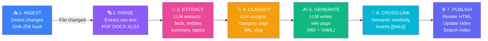
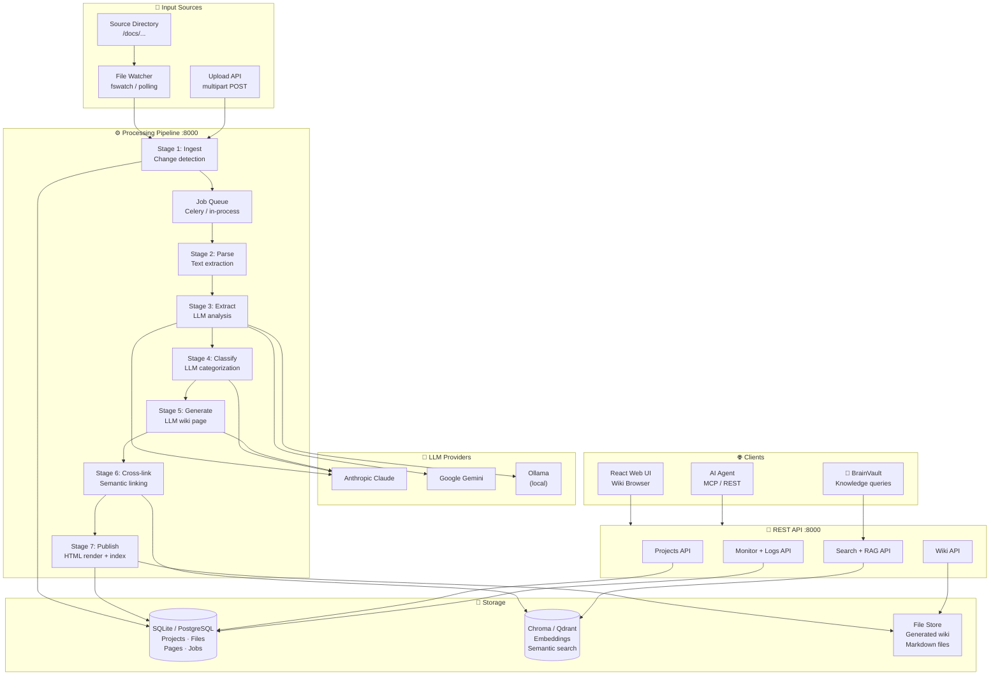
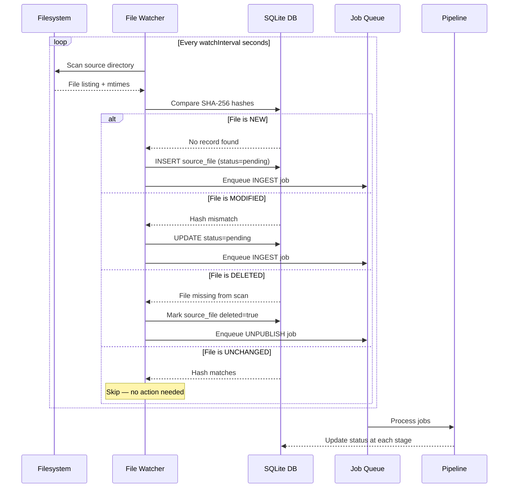

<div align="center">

```
██╗    ██╗██╗██╗  ██╗██╗██╗     ██╗     ███╗   ███╗
██║    ██║██║██║ ██╔╝██║██║     ██║     ████╗ ████║
██║ █╗ ██║██║█████╔╝ ██║██║     ██║     ██╔████╔██║
██║███╗██║██║██╔═██╗ ██║██║     ██║     ██║╚██╔╝██║
╚███╔███╔╝██║██║  ██╗██║███████╗███████╗██║ ╚═╝ ██║
 ╚══╝╚══╝ ╚═╝╚═╝  ╚═╝╚═╝╚══════╝╚══════╝╚═╝     ╚═╝
```

### 📚 Self-Hosted AI Document-to-Wiki Engine

*Drop files into a folder → get a structured, cross-linked, searchable wiki — automatically.*

[](https://github.com/nexuslayer/wikillm)
[](https://github.com/nexuslayer/wikillm/releases)
[](LICENSE)
[](https://python.org)
[](https://fastapi.tiangolo.com)
[](https://react.dev)
[](https://anthropic.com)
[](https://deepmind.google/technologies/gemini/)
[](https://ollama.ai)
[](../README.md)

<br/>

[**Live Demo**](http://192.168.68.111:8000) · [**API Docs**](http://192.168.68.111:8000/docs) · [**Report Bug**](https://github.com/nexuslayer/wikillm/issues) · [**Request Feature**](https://github.com/nexuslayer/wikillm/issues)

</div>

---

## 📋 Table of Contents

- [✨ Features](#-features)
- [⚡ The 7-Stage Pipeline](#-the-7-stage-pipeline)
- [🏗️ Architecture](#%EF%B8%8F-architecture)
- [🚀 Quick Start](#-quick-start)
- [📡 API Reference](#-api-reference)
- [🔧 SDKs & Integration](#-sdks--integration)
- [🔀 Ecosystem Integrations](#-ecosystem-integrations)
- [🤖 Claude Code CLI / MCP](#-claude-code-cli--mcp)
- [⚙️ Configuration](#%EF%B8%8F-configuration)
- [🧑‍💻 Development](#-development)
- [🆚 Why WikiLLM?](#-why-wikillm)
- [📄 License](#-license)

---

## ✨ Features

| Feature | Description |
|---|---|
| 📂 **Drop-folder Ingestion** | Watch a directory — new or changed files are auto-detected and queued |
| 🔄 **7-Stage Pipeline** | Ingest → Parse → Extract → Classify → Generate → Cross-link → Publish |
| 🔁 **Delta Processing** | Only reprocess changed files (SHA-256 hash tracking) — no wasteful full rebuilds |
| 🧩 **Multi-Format Parsing** | `.md`, `.doc`, `.docx`, `.xlsx`, `.xls`, `.csv`, `.pdf` — all supported |
| 🤖 **Multi-LLM Support** | Anthropic Claude, Google Gemini, Ollama — configurable per project |
| 🔗 **Auto Cross-linking** | Semantic similarity finds related pages and inserts `[[wiki links]]` automatically |
| 🔍 **Semantic Search** | Vector search across all wiki pages — find by meaning, not just keywords |
| 💬 **RAG Query API** | `POST /api/query {question}` → answer grounded in your docs |
| 📊 **Cost Tracking** | Token usage and LLM cost tracked per file, per stage, per project |
| 🏗️ **REST API** | Full CRUD + agent-friendly RAG endpoints — MCP-ready |
| 🌐 **Web UI** | Built-in wiki browser with real-time pipeline progress dashboard |

---

## ⚡ The 7-Stage Pipeline



<details>
<summary><strong>Stage details & code examples</strong></summary>

### Stage 1: INGEST — Change Detection

```python
# SHA-256 hash prevents reprocessing unchanged files
content_hash = sha256(filepath.read_bytes()).hexdigest()

if source_file.content_hash == content_hash and source_file.status == "published":
    return  # Skip — file unchanged since last run

source_file.content_hash = content_hash
source_file.status = "ingested"
```

### Stage 2: PARSE — Multi-Format Extraction

```python
# Unified parser interface
parser = ParserRegistry.get_parser(filepath)  # auto-detected by extension
parsed = parser.parse(filepath)
# → {full_text, sections[], tables[], metadata, word_count}
```

Supported formats:

| Format | Parser | Notes |
|--------|--------|-------|
| `.pdf` | PyMuPDF | Text + embedded table extraction |
| `.docx` | python-docx | Heading-aware, preserves structure |
| `.xlsx` / `.xls` | openpyxl | Each sheet → structured table |
| `.csv` | pandas | Column-aware, handles encodings |
| `.md` | native | Full CommonMark + frontmatter |

### Stage 3: EXTRACT — LLM Knowledge Mining

```python
prompt = render_template("extract.j2", {
    "filename": source_file.filename,
    "content": parsed.content_text,  # truncated to max_tokens
})

response = await llm.complete(LLMRequest(
    system_prompt="You are a document analysis expert. Return valid JSON only.",
    user_prompt=prompt,
    response_format="json",
    temperature=0.2,
))

# Returns: {summary, topics[], entities[], key_points[]}
```

### Stage 5: GENERATE — Wiki Page Generation

```python
# LLM output is always structured Markdown + YAML frontmatter
wiki_page_template = """
---
title: {page_title}
category: {category}
tags: {tags}
source_file: {filename}
generated_at: {timestamp}
---

# {page_title}

## Summary
{summary}

## Key Points
{key_points_as_bullets}

## Details
{detailed_content}

## Related Topics
{related_topics}
"""
```

### Stage 6: CROSS-LINK — Semantic Auto-linking

```python
# Compute embeddings for all wiki pages
# Find top-k similar pages via cosine similarity
# Insert [[PageTitle]] links into content where relevant
similar_pages = await vector_store.search(
    embedding=page_embedding,
    filter={"project_id": project.id},
    top_k=5,
    min_score=0.75,
)
```

</details>

---

## 🏗️ Architecture



### File Watcher & Delta Detection



---

## 🚀 Quick Start

### Option A: Docker Compose (Recommended)

```bash
git clone https://github.com/nexuslayer/wikillm.git
cd wikillm

cp .env.example .env
```

Edit `.env`:

```bash
# LLM Provider (choose one)
LLM_PROVIDER=anthropic
ANTHROPIC_API_KEY=sk-ant-...

# OR: Google Gemini
# LLM_PROVIDER=gemini
# GEMINI_API_KEY=...

# OR: Local Ollama (no API key needed)
# LLM_PROVIDER=ollama
# OLLAMA_BASE_URL=http://ollama:11434
# OLLAMA_MODEL=llama3.2

# Optional auth
WIKILLM_API_KEY=your_api_key_here   # leave empty to disable auth
```

```bash
docker compose up -d
```

```
✅ WikiLLM API  → http://localhost:8000
✅ Web UI       → http://localhost:8000/ui
✅ API Docs     → http://localhost:8000/docs
```

### Option B: Python (uv/pip)

```bash
git clone https://github.com/nexuslayer/wikillm.git
cd wikillm/wikiforge

# Using uv (recommended)
uv venv && source .venv/bin/activate
uv pip install -r requirements.txt

# Or pip
python -m venv .venv && source .venv/bin/activate
pip install -r requirements.txt

cp .env.example .env
uvicorn app.main:app --reload --port 8000
```

### 3-Minute Demo

```bash
API="http://localhost:8000"
H='-H "X-API-Key: your_api_key_here"'   # omit if auth disabled

# 1. Create a project
PROJECT=$(curl -s -X POST $API/api/projects \
  -H "Content-Type: application/json" \
  -d '{
    "name": "Engineering Docs",
    "sourceDir": "/home/user/docs/engineering",
    "outputDir": "/home/user/wiki/engineering",
    "llmProvider": "anthropic",
    "watchInterval": 60
  }')

PROJECT_ID=$(echo $PROJECT | jq -r .id)
echo "Project: $PROJECT_ID"

# 2. Drop a file and trigger
cp ~/my_design_doc.pdf /home/user/docs/engineering/
curl -s -X POST $API/api/projects/$PROJECT_ID/trigger

# 3. Watch pipeline progress
watch -n 3 "curl -s $API/api/projects/$PROJECT_ID/status | jq '{total: .totalFiles, done: .publishedFiles, inProgress: .processingFiles}'"

# 4. Browse the wiki
curl -s $API/api/projects/$PROJECT_ID/wiki | jq '[.[].title]'

# 5. Ask a question (RAG)
curl -s -X POST $API/api/query \
  -H "Content-Type: application/json" \
  -d "{\"projectId\": \"$PROJECT_ID\", \"question\": \"How does our auth system work?\"}" \
  | jq '{answer: .answer, sources: [.sources[].title]}'
```

---

## 📡 API Reference

### Projects

| Method | Endpoint | Description |
|--------|----------|-------------|
| `GET` | `/api/projects` | List all projects |
| `POST` | `/api/projects` | Create project (`name`, `sourceDir`, `outputDir`, `llmProvider`) |
| `GET` | `/api/projects/{id}` | Project details + stats |
| `PUT` | `/api/projects/{id}` | Update project config |
| `DELETE` | `/api/projects/{id}` | Delete project |
| `POST` | `/api/projects/{id}/trigger` | Trigger full rebuild |
| `GET` | `/api/projects/{id}/status` | Real-time pipeline status |
| `GET` | `/api/projects/{id}/logs` | Processing logs (paginated) |

### Files

| Method | Endpoint | Description |
|--------|----------|-------------|
| `GET` | `/api/projects/{id}/files` | List source files + status |
| `POST` | `/api/files/upload` | Upload file to project (multipart) |
| `GET` | `/api/files/{fileId}` | File details + processing history |
| `DELETE` | `/api/files/{fileId}` | Remove file + unpublish wiki page |

### Wiki

| Method | Endpoint | Description |
|--------|----------|-------------|
| `GET` | `/api/projects/{id}/wiki` | List all wiki pages |
| `GET` | `/api/wiki/{pageId}` | Get wiki page (`?format=markdown\|html\|json`) |
| `GET` | `/api/projects/{id}/wiki/tree` | Hierarchical category tree |
| `GET` | `/api/wiki/{pageId}/related` | Related wiki pages (semantic) |

### Search & RAG

| Method | Endpoint | Description |
|--------|----------|-------------|
| `POST` | `/api/search` | Semantic search (`projectId`, `query`, `limit`) |
| `POST` | `/api/query` | **RAG query** → `{question, projectId}` returns `{answer, sources[]}` |
| `POST` | `/api/context` | Retrieve context chunks for a question (agent-friendly) |

### Monitoring

| Method | Endpoint | Description |
|--------|----------|-------------|
| `GET` | `/api/projects/{id}/usage` | Token usage and LLM cost per project |
| `GET` | `/health` | Health check (returns service status) |
| `GET` | `/api/openapi.json` | OpenAPI 3.1 spec |

---

## 🔧 SDKs & Integration

### Python Client

```python
import httpx
import time

API = "http://localhost:8000"
API_KEY = "your_api_key"

class WikiLLMClient:
    def __init__(self, api_key: str = None):
        headers = {"X-API-Key": api_key} if api_key else {}
        self.http = httpx.Client(base_url=API, headers=headers)

    def create_project(self, name: str, source_dir: str,
                       llm_provider: str = "anthropic",
                       watch_interval: int = 60) -> dict:
        return self.http.post("/api/projects", json={
            "name": name,
            "sourceDir": source_dir,
            "llmProvider": llm_provider,
            "watchInterval": watch_interval,
        }).json()

    def upload(self, project_id: str, filepath: str) -> dict:
        with open(filepath, "rb") as f:
            return self.http.post("/api/files/upload", data={
                "projectId": project_id
            }, files={"file": f}).json()

    def trigger(self, project_id: str) -> None:
        self.http.post(f"/api/projects/{project_id}/trigger")

    def wait_for_idle(self, project_id: str) -> dict:
        while True:
            status = self.http.get(f"/api/projects/{project_id}/status").json()
            if status["processingFiles"] == 0 and status["pendingFiles"] == 0:
                return status
            print(f"  ⏳ {status['processingFiles']} processing, "
                  f"{status['pendingFiles']} pending...")
            time.sleep(5)

    def query(self, project_id: str, question: str) -> dict:
        return self.http.post("/api/query", json={
            "projectId": project_id,
            "question": question,
        }).json()

    def search(self, project_id: str, query: str, limit: int = 5) -> list:
        return self.http.post("/api/search", json={
            "projectId": project_id,
            "query": query,
            "limit": limit,
        }).json()


# --- Usage ---
wiki = WikiLLMClient(API_KEY)

# Create a project
project = wiki.create_project(
    name="API Documentation",
    source_dir="/docs/api",
    llm_provider="anthropic",
)

# Upload and process files
for path in ["/docs/api/auth.md", "/docs/api/endpoints.pdf", "/docs/api/models.xlsx"]:
    print(f"Uploading {path}...")
    wiki.upload(project["id"], path)

wiki.trigger(project["id"])
status = wiki.wait_for_idle(project["id"])
print(f"✅ Wiki built: {status['publishedFiles']} pages")

# Query
result = wiki.query(project["id"], "How do I authenticate API requests?")
print(f"\n{result['answer']}\n")
for src in result["sources"]:
    print(f"  ↳ [{src['title']}]({src['url']}) — {src['excerpt'][:80]}...")

# Semantic search
pages = wiki.search(project["id"], "rate limiting and throttling")
for page in pages:
    print(f"  📄 {page['title']} (score: {page['score']:.2f})")
```

### cURL — Quick Integration

```bash
# Create project
PROJECT=$(curl -s -X POST http://localhost:8000/api/projects \
  -H "X-API-Key: $WIKILLM_KEY" \
  -H "Content-Type: application/json" \
  -d '{"name":"DevDocs","sourceDir":"/srv/docs","llmProvider":"anthropic"}')

# Upload a document
curl -s -X POST http://localhost:8000/api/files/upload \
  -H "X-API-Key: $WIKILLM_KEY" \
  -F "projectId=$(echo $PROJECT | jq -r .id)" \
  -F "file=@./architecture.pdf"

# RAG query
curl -s -X POST http://localhost:8000/api/query \
  -H "X-API-Key: $WIKILLM_KEY" \
  -H "Content-Type: application/json" \
  -d "{
    \"projectId\": \"$(echo $PROJECT | jq -r .id)\",
    \"question\": \"What database do we use for the user service?\"
  }" | jq .answer
```

### GitHub Actions — Auto-update Wiki on Push

```yaml
name: Update Wiki on Docs Change
on:
  push:
    paths: ['docs/**']

jobs:
  update-wiki:
    runs-on: ubuntu-latest
    steps:
      - uses: actions/checkout@v4
      - name: Sync docs to WikiLLM
        run: |
          for file in $(git diff --name-only HEAD~1 HEAD -- docs/); do
            curl -s -X POST ${{ secrets.WIKILLM_URL }}/api/files/upload \
              -H "X-API-Key: ${{ secrets.WIKILLM_KEY }}" \
              -F "projectId=${{ secrets.WIKILLM_PROJECT_ID }}" \
              -F "file=@$file"
          done
          curl -s -X POST ${{ secrets.WIKILLM_URL }}/api/projects/${{ secrets.WIKILLM_PROJECT_ID }}/trigger
```

---

## 🔀 Ecosystem Integrations

| Product | Direction | Integration |
|---------|-----------|-------------|
| 🔀 [**ModelRouter**](../ModelRouter/README.md) | WikiLLM → ModelRouter | All LLM calls (extract, classify, generate stages) routed through ModelRouter for cost control, rate limiting, and multi-provider fallback |
| 🌊 [**FlowMesh**](../flowmesh/README.md) | FlowMesh → WikiLLM | FlowMesh `WEBHOOK` nodes trigger full rebuilds or single-file processing — e.g., "rebuild wiki when a new doc is committed to GitHub" |
| 📊 [**WatchGrid**](../watchgrid/README.md) | WikiLLM → WatchGrid | Pipeline run events, LLM token costs, and processing errors shipped to WatchGrid for centralized observability |
| 🧠 [**BrainVault**](../BrainVault/README.md) | BrainVault → WikiLLM | BrainVault queries WikiLLM's `/api/query` endpoint to enrich personal notes with structured team/organizational knowledge |
| 🤖 [**AgentShop**](../AIAgentRental/README.md) | AgentShop → WikiLLM | AgentShop agents query WikiLLM context before executing tasks — grounding agent output in team documentation |

---

## 🤖 Claude Code CLI / MCP

WikiLLM serves as an **MCP (Model Context Protocol)** knowledge server. Any Claude Code CLI task can query your wikis for context before generating code or documentation.

### Available MCP Tools

| Tool | Description |
|------|-------------|
| `wikillm_query` | RAG query — answer from wiki docs |
| `wikillm_search` | Semantic search — return matching wiki pages |
| `wikillm_get_page` | Get full wiki page by title or ID |
| `wikillm_list_pages` | List all pages in a project/category |
| `wikillm_upload` | Upload a document for processing |

### Configure MCP in Claude Code

```json
{
  "mcpServers": {
    "wikillm": {
      "url": "http://localhost:8000/mcp",
      "headers": {
        "X-API-Key": "YOUR_WIKILLM_API_KEY"
      }
    }
  }
}
```

### Usage Example

```bash
# Claude reads your wiki before writing code
claude -p "Review our existing authentication architecture from the wiki,
           then implement a JWT refresh token rotation endpoint following
           our established patterns" \
  --mcp wikillm

# Or reference a specific project
claude -p "Based on our API documentation wiki, write integration tests
           for the /users endpoint covering all documented edge cases" \
  --mcp wikillm \
  --mcp-context "projectId=engineering-docs"
```

### Direct API Usage from Claude Prompt

```python
# Claude Code can call WikiLLM directly within task execution
import httpx

context = httpx.post("http://localhost:8000/api/context", json={
    "projectId": "engineering-docs",
    "question": "How does our payment service handle retries?",
    "maxChunks": 5
}).json()

# Use context to ground code generation
for chunk in context["chunks"]:
    print(f"Source: {chunk['title']}\n{chunk['text']}\n")
```

---

## ⚙️ Configuration

### Environment Variables

| Variable | Required | Default | Description |
|----------|----------|---------|-------------|
| `LLM_PROVIDER` | ✅ | `anthropic` | `anthropic` \| `gemini` \| `ollama` |
| `ANTHROPIC_API_KEY` | ⚠️ | — | Required if `LLM_PROVIDER=anthropic` |
| `GEMINI_API_KEY` | ⚠️ | — | Required if `LLM_PROVIDER=gemini` |
| `OLLAMA_BASE_URL` | ⚠️ | `http://localhost:11434` | Required if `LLM_PROVIDER=ollama` |
| `OLLAMA_MODEL` | — | `llama3.2` | Ollama model name |
| `LLM_MODEL` | — | `claude-sonnet-4-5` | LLM model (provider-specific) |
| `DATABASE_URL` | — | `sqlite:///./data/wikillm.db` | SQLAlchemy DB URL |
| `VECTOR_STORE` | — | `chroma` | `chroma` \| `qdrant` |
| `CHROMA_PATH` | — | `./data/chroma` | Chroma persistence directory |
| `QDRANT_URL` | — | — | Qdrant URL (if `VECTOR_STORE=qdrant`) |
| `WIKILLM_API_KEY` | — | — | API authentication key (leave empty to disable) |
| `MAX_FILE_SIZE_MB` | — | `50` | Maximum upload file size |
| `CHUNK_SIZE` | — | `1000` | Text chunk size (chars) for embeddings |
| `CHUNK_OVERLAP` | — | `200` | Overlap between chunks |
| `CROSSLINK_MIN_SCORE` | — | `0.75` | Minimum similarity score for cross-links |
| `CROSSLINK_MAX_LINKS` | — | `5` | Max cross-links per wiki page |
| `WATCH_INTERVAL` | — | `60` | File watcher poll interval (seconds) |
| `WORKER_CONCURRENCY` | — | `4` | Parallel pipeline workers |
| `LLM_TIMEOUT` | — | `120` | LLM request timeout (seconds) |
| `MODELROUTER_URL` | — | — | ModelRouter endpoint (optional) |
| `WATCHGRID_URL` | — | — | WatchGrid ingest endpoint |

<details>
<summary><strong>Full docker-compose.yml</strong></summary>

```yaml
version: '3.8'
services:
  wikillm:
    build: ./wikiforge
    ports: ["8000:8000"]
    environment:
      LLM_PROVIDER: ${LLM_PROVIDER:-anthropic}
      ANTHROPIC_API_KEY: ${ANTHROPIC_API_KEY}
      DATABASE_URL: sqlite:////data/wikillm.db
      VECTOR_STORE: chroma
      CHROMA_PATH: /data/chroma
      WIKILLM_API_KEY: ${WIKILLM_API_KEY}
    volumes:
      - wikillm_data:/data
      - ${SOURCE_DOCS_PATH:-./docs}:/docs:ro   # mount your docs
    restart: unless-stopped

  # Optional: Qdrant instead of Chroma
  qdrant:
    image: qdrant/qdrant:latest
    ports: ["6333:6333"]
    volumes: ["qdrant_data:/qdrant/storage"]
    profiles: ["qdrant"]

volumes:
  wikillm_data:
  qdrant_data:
```

</details>

<details>
<summary><strong>config.yaml — Project-level config</strong></summary>

```yaml
# Placed in source directory as .wikillm.yaml
project:
  name: "Engineering Documentation"
  llmProvider: anthropic
  llmModel: claude-sonnet-4-5
  watchInterval: 60
  updateMode: delta   # delta | full

pipeline:
  maxFileSize: 50MB
  chunkSize: 1000
  chunkOverlap: 200

wiki:
  crosslinkMinScore: 0.75
  crosslinkMaxLinks: 5
  defaultCategory: "General"

ignore:
  - "*.tmp"
  - ".git/**"
  - "node_modules/**"
  - "_drafts/**"
```

</details>

---

## 🧑‍💻 Development

### Local Setup

```bash
git clone https://github.com/nexuslayer/wikillm.git
cd wikillm/wikiforge

# Setup Python environment
python -m venv .venv
source .venv/bin/activate  # Windows: .venv\Scripts\activate
pip install -r requirements.txt
pip install -r requirements-dev.txt

# Configure
cp .env.example .env
# Edit .env — set ANTHROPIC_API_KEY or OLLAMA_BASE_URL

# Run API
uvicorn app.main:app --reload --port 8000

# Run frontend (React UI)
cd ../wikiforge-ui
npm install && npm run dev
```

### Project Structure

```
wikillm/
├── wikiforge/                    # Python FastAPI backend
│   ├── app/
│   │   ├── api/                  # FastAPI route handlers
│   │   │   ├── projects.py       # Project CRUD
│   │   │   ├── files.py          # File upload + management
│   │   │   ├── wiki.py           # Wiki page retrieval
│   │   │   ├── search.py         # Semantic search + RAG
│   │   │   └── mcp.py            # MCP server endpoints
│   │   ├── pipeline/             # 7-stage processing pipeline
│   │   │   ├── ingest.py         # Stage 1: Change detection
│   │   │   ├── parse.py          # Stage 2: File parsers
│   │   │   ├── extract.py        # Stage 3: LLM extraction
│   │   │   ├── classify.py       # Stage 4: LLM classification
│   │   │   ├── generate.py       # Stage 5: Wiki page generation
│   │   │   ├── crosslink.py      # Stage 6: Semantic cross-linking
│   │   │   └── publish.py        # Stage 7: HTML rendering + indexing
│   │   ├── llm/                  # Multi-provider LLM abstraction
│   │   │   ├── base.py           # Provider interface
│   │   │   ├── anthropic.py      # Claude provider
│   │   │   ├── gemini.py         # Gemini provider
│   │   │   └── ollama.py         # Ollama provider
│   │   ├── parsers/              # File format parsers
│   │   │   ├── pdf.py            # PyMuPDF
│   │   │   ├── docx.py           # python-docx
│   │   │   ├── xlsx.py           # openpyxl
│   │   │   ├── csv_parser.py     # pandas
│   │   │   └── markdown.py       # native Markdown
│   │   ├── watcher.py            # File system watcher
│   │   ├── models.py             # SQLAlchemy models
│   │   └── main.py               # FastAPI app entry
│   ├── prompts/                  # Jinja2 LLM prompt templates
│   │   ├── extract.j2
│   │   ├── classify.j2
│   │   └── generate.j2
│   └── tests/
├── wikiforge-ui/                 # React frontend
│   └── src/
│       ├── pages/                # Dashboard, Wiki browser, Monitor
│       └── components/           # PipelineStatus, WikiTree, etc.
└── docker-compose.yml
```

### Running Tests

```bash
cd wikiforge

# Unit tests
pytest tests/unit/ -v

# Pipeline integration tests (uses Ollama — no API key needed)
LLM_PROVIDER=ollama pytest tests/integration/ -v

# All tests with coverage
pytest tests/ --cov=app --cov-report=html
open htmlcov/index.html
```

---

## 🆚 Why WikiLLM?

| Feature | WikiLLM | Confluence | GitBook | Notion | Custom Scripts |
|---------|:-------:|:----------:|:-------:|:------:|:--------------:|
| **Auto-sync from files** | ✅ | ❌ | ❌ | ❌ | ⚠️ fragile |
| **AI-generated wiki pages** | ✅ | ❌ | ❌ | ⚠️ manual | ❌ |
| **Self-hosted** | ✅ | ⚠️ Data Center | ❌ | ❌ | ✅ |
| **Multi-format input** | ✅ | ⚠️ limited | ❌ | ⚠️ | ✅ |
| **Semantic search** | ✅ | ⚠️ paid | ❌ | ⚠️ | ❌ |
| **RAG query API** | ✅ | ❌ | ❌ | ❌ | ❌ |
| **Auto cross-linking** | ✅ | ❌ | ❌ | ❌ | ❌ |
| **Delta processing** | ✅ | N/A | N/A | N/A | ⚠️ |
| **MCP / agent integration** | ✅ | ❌ | ❌ | ❌ | ❌ |
| **Price** | **Free / Self-hosted** | $5.75/seat/mo | $8+/mo | $10+/mo | Dev time |

---

## 📄 License

MIT License — see [LICENSE](LICENSE) for details.

---

<div align="center">

**WikiLLM** is part of the **NexusLayer Platform** — a suite of self-hosted AI developer tools.

[AgentShop](../AIAgentRental/README.md) · [BrainVault](../BrainVault/README.md) · [PeriodAI](../PeriodAIProduct/README.md) · [WikiLLM](../WikiLLM/README.md) · [ModelRouter](../ModelRouter/README.md) · [AgentVault](../AgentVault/README.md) · [FlowMesh](../flowmesh/README.md) · [WatchGrid](../watchgrid/README.md)

<br/>

*Drop files in. Get a wiki out.*

</div>
